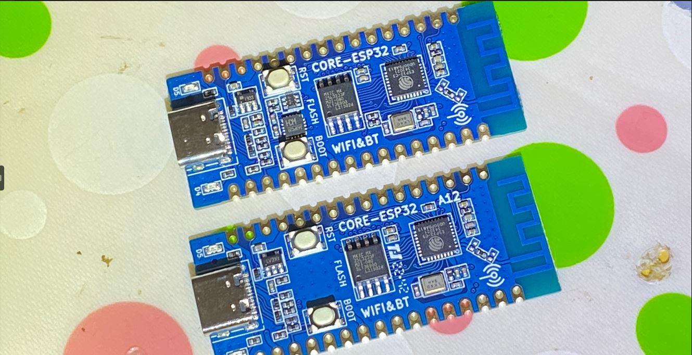
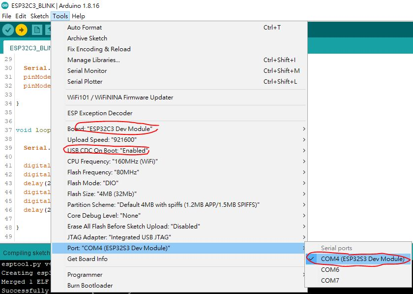
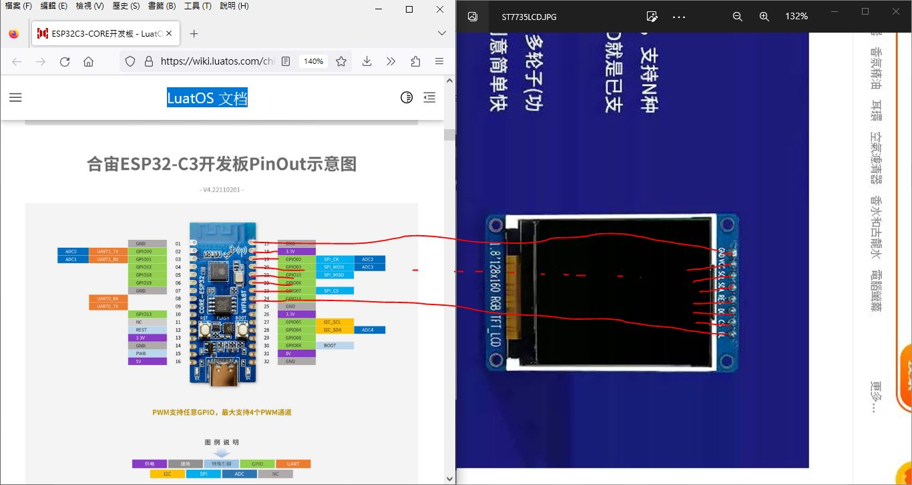
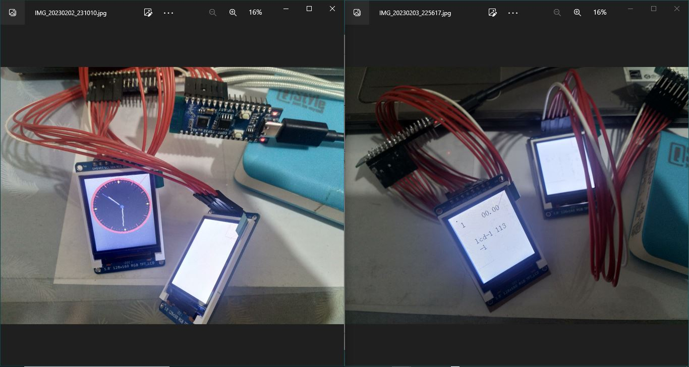
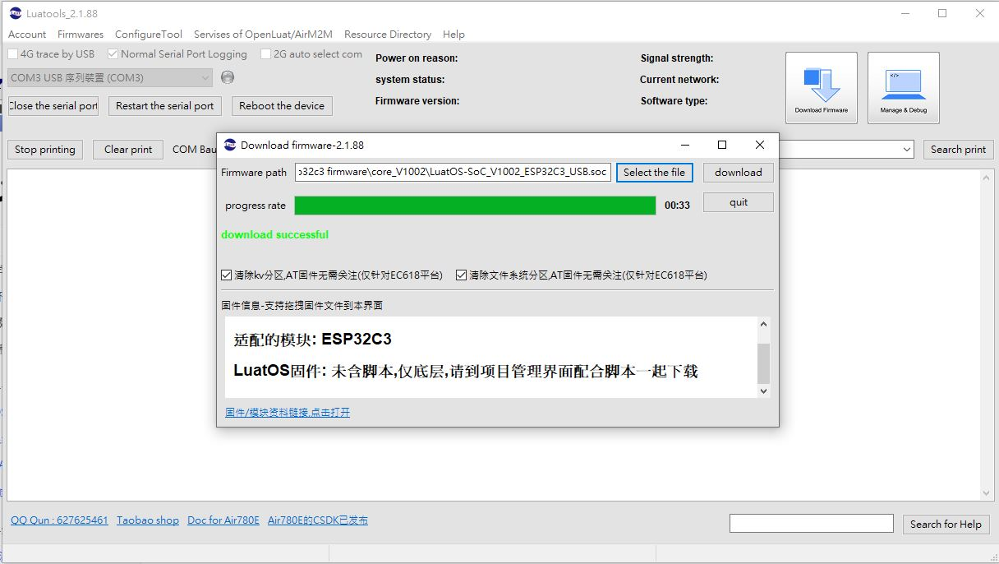
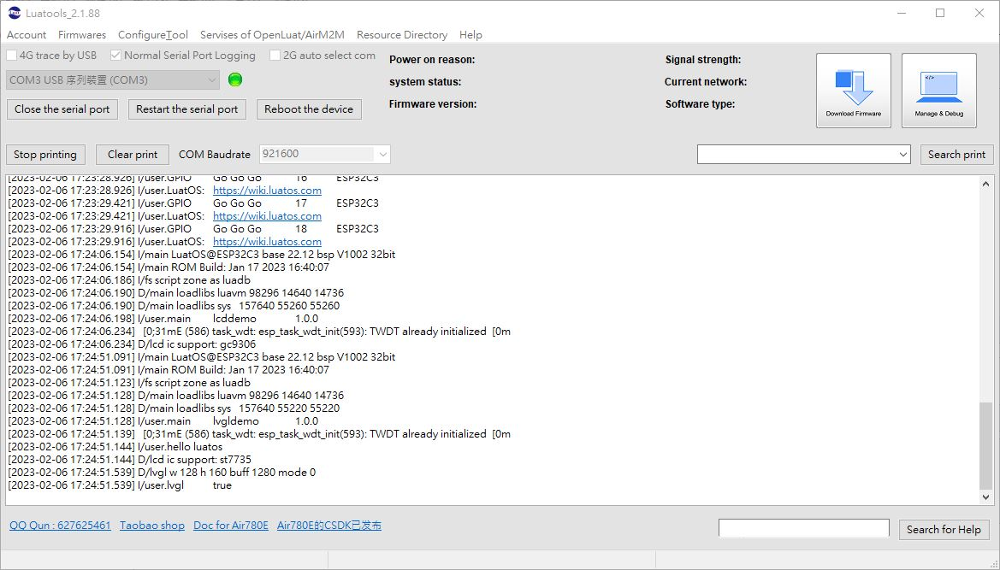
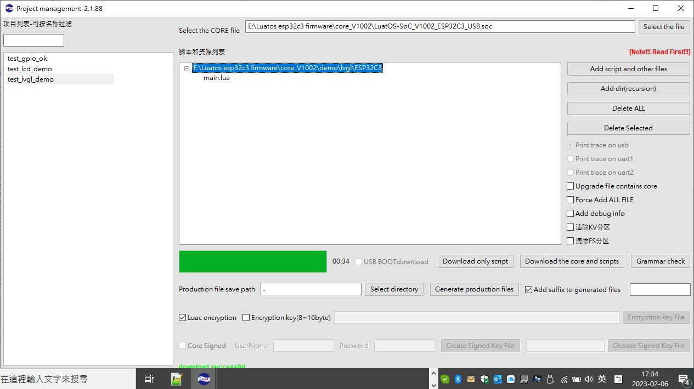
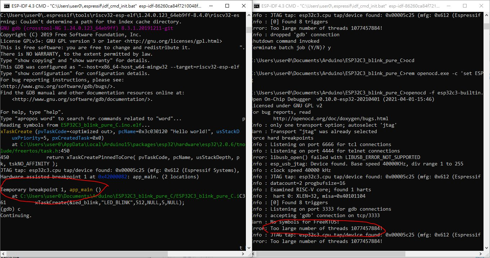
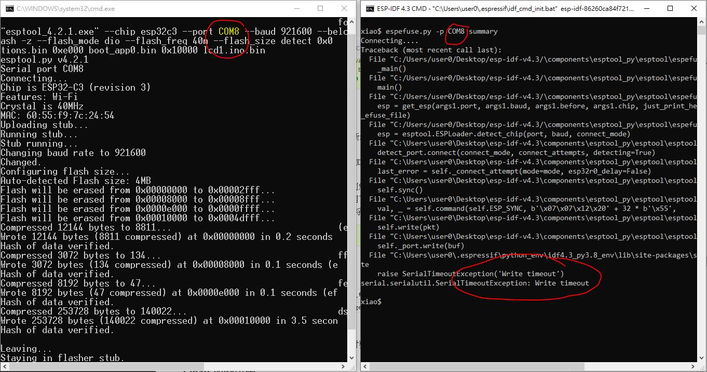
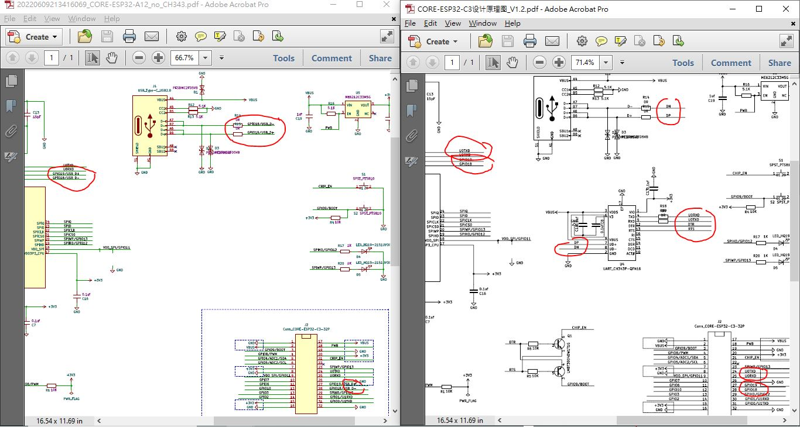

# Luatos_EPS32_C3_C3-L_ST7735_what_a_bug  


### 2021-11-12 update, seems bug fixed
v1005


### Luatos core-esp32c3 and core-esp32c3L, very different response by LCD ST7735  
testing under v1002/v1003
Luatos_EPS32_C3, CH343 USB-UART chip is used.  
Luatos_EPS32_C3-L, GPIO18 and GPIO19 used for USG-JTAG, no CH343 used.  


tested with a few LCD ST7735 libray, but no luck.  

there are two different boards manufactured by Luatos
  

只好問問原廠 https://github.com/espressif/arduino-esp32/issues/7808  
試試看這坑怎樣填....暫時裸奔還是不好的選擇, 配個 USB-UART chip 比較可靠.  


the code, the same, the buring flash process the same, one is working and the other hang on reboot, did not work. but why was that ? 

ESP32C3 chip, VID/PID is belonging to esp, but the reported CDC is saying S3 chip ? why ?  
    


Luatos 那個 ESP32C3 板子, 本來以為很容易, 結果上馬就翻車. 接上 ST7735 的 LCD, 有 CH343 的那個板沒事. 純粹 USB 的那板就是點不了 LCD, 燒寫完畢直接沒有啟動的樣子. 以為板子壞了, 換了幾個板都一樣, 真不知道貓膩哪裡了. 用或不用 GUI庫, 情形都相同. 給他燒了 LED跑馬燈, 確定沒問題, 燒寫後自動運行完全沒問題. 有大俠知道C3這顆祕密嗎. 還是遺漏了甚麼..  

GPIO12 / GPIO13 LED跑馬燈, 源碼及燒錄工具, https://github.com/xiaolaba/Luatos_EPS32_C3_C3-L_blinking_test  

### 這板板  
https://wiki.luatos.com/chips/esp32c3/board.html  

### 這電路圖  
https://wiki.luatos.com/chips/esp32c3/hardware.html  

### 這源碼  
抄襲 https://github.com/WINKCM/Arduino-ESP32-TFTLCD-ST7735  
自行改過的  
[lcd1.ino](lcd1.ino)  
[LCD1.cpp](LCD1.cpp)   
[lcd1.h](lcd1.h)  

### 這樣改  
```
// xiaolaba
// luatos Core ESP32-C3, USB-UART CH340G, test done, ok
// luatos Core ESP32-C3L, no CH340G, no working ??
#define SCL 2
#define SDA 3
#define RES 10
#define DC 6
#define CS 7
#define BL 11
```

### 接線圖  
  


### 這結果
simple test code of repo and library TFT_eSPI demo code TFT_Clock  
same bug, same result,  
  


### Luatos 的原廠 demo 測試, 狀況依然  
update : 2023-11-12  lutaostoo.exe download link & recap,  
https://wiki.luatos.com/chips/esp32c3/index.html  

https://wiki.luatos.com/pages/tools.html  
E:\Luatos esp32c3 firmware\  
Luatools_v2.2.15.exe  

update and download, vcore for C3
E:\Luatos esp32c3 firmware\resource\esp32c3_lua_lod  
core_V1005


  
  
  

老闆這樣建議, 其實不知道要幹個嘛   
https://github.com/chenxuuu/luatos-wiki/discussions/11#discussioncomment-4863375  

### 跟老師報告, 擱置, 有緣再說..
已經很懶惰了, 勉強開個 gdb 套個 Openocd, 看看 jtag debug 有甚麼一堆英文字跑出來, 其實是沒用的, 記號而已, 老師看過就滿足了.
open 2 ESP-IDF console, OpenOCD and GDB on each, debugging sessions succeed
  


### 查一下efuse
它又不動作, 同樣COM8, 都是 esptool 呼叫的, 可以燒寫, 但是 espefuse 連不到 COM8, 醉了還是有坑, 不豬到...  

```
espefuse.py -p PORT summary
```
  


### 看看電路圖比較  
沒有特殊
  


### 有興趣實際操作 RISCV asm 的話, 看看無妨.. 
https://www.espressif.com/en/media_overview/news/risc-v-with-esp32-c3  
只有墊子書, 梅印刷本, https://www.elektor.com/risc-v-assembly-language-programming-using-esp32-c3-and-qemu  
